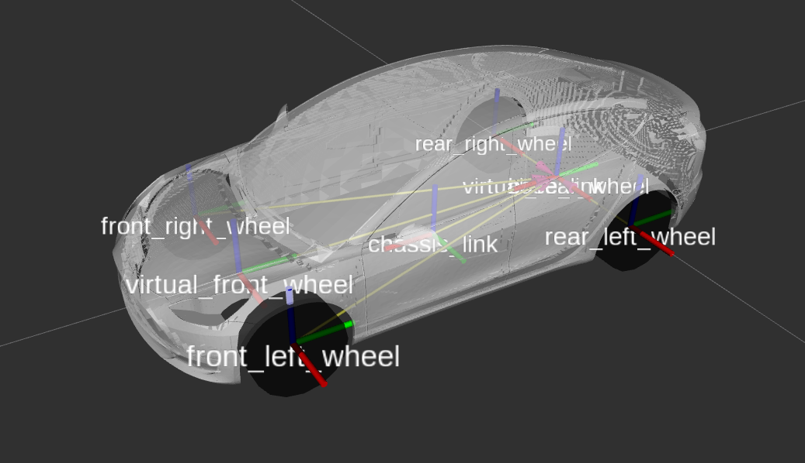

# ROS2_CONTROL DEMOS WITH MOBILEBOT

Demonstrations of mobile robots (**mobilebot**) driven by [ROS2 CONTROLLERS](https://github.com/ros-controls/ros2_controllers), namely ackermann, bicycle, differential and other drive controllers. The demos are based on the [official ros2_control_demos](https://github.com/ros-controls/ros2_control_demos), specifically:  
&emsp;&emsp;-> [ros2_control_demo_example_2](https://control.ros.org/master/doc/ros2_control_demos/example_2/doc/userdoc.html) (diffbot)  
&emsp;&emsp;-> [ros2_control_demo_example_11](https://control.ros.org/master/doc/ros2_control_demos/example_11/doc/userdoc.html) (carlikebot)  


## Custom MESHES
Custom mesh(es) is/are used here. Details in table below:  
|mobilebot|stl file|description|source|  
|---------|--------|-----------|------|  
|carlikebot|[tesla_model3_rc_car_body.stl](ros2_control_demo_description/carlikebot/meshes)|Tesla Model 3, ratio 1:10, dim 423x185x124 mm³| https://www.thingiverse.com/thing:4817952|   

Visualized CARLIKEBOT with BICYCLEDRIVE  
  

## Quick Start with Docker in Linux

### Docker BUILD

```sh
#edit the Dockerfile (refer to comments)
sudo docker build . -t ros2_control_demos -f Dockerfile/Dockerfile
```

Once built, you may modify the demo package, and build a new image on top of it. For example
```sh
sudo docker build . -t ros2_control_demos2 -f Dockerfile/Dockerfile2
```

### Docker RUN

To grant access to the X server for any process running as root (e.g. running GUI app with sudo) on the same machine 
```sh
# ! Allowing privileged process in root to connect to and interact with your X session can be a security risk !
# ! Use this command only temporarily when needed !
xhost +local:root  # run `xhost -local:root` to revoke access
```

To run the default command (bicycledrivebot demo with GUI)
```sh
# Default command is defined with CMD instruction in Dockerfile.
# running script below will run the carlikebot state publisher, bicycle controller server and RViz
docker run -it --rm --privileged -e DISPLAY=$DISPLAY -v /tmp/.X11-unix:/tmp/.X11-unix --net=host --ipc=host --pid=host ros2_control_demos
```

Custom commands are also possible. For example:  

&emsp;&emsp;To run the bicycledrivebot demo with separate sensors and actuators hardware
```sh
docker run -it --rm --net=host --ipc=host --pid=host ros2_control_demos ros2 launch ros2_control_demo_bicycledrivebot_carlike carlikebot_separate_sensors_and_actuators.launch.py remap_odometry_tf:=true gui:=false
```

&emsp;&emsp;To run ros2 topic list
```sh
docker run -it --rm --net=host --ipc=host --pid=host ros2_control_demos ros2 topic list
# use the same net, ipc and pid values so that the two containers can listen to each other
```

&emsp;&emsp;To access the bash terminal in the docker terminal and test different things
```sh
docker run -it --rm --net=host --ipc=host --pid=host ros2_control_demos bash
# use 'exit' command to exit the terminal or click 'Ctrl+D'
```
> ros2 control services  
> &emsp;&emsp;ros2 control list_controllers  
> &emsp;&emsp;ros2 control list_controller_types  
> &emsp;&emsp;ros2 control list_hardware_components  
> &emsp;&emsp;ros2 control list_hardware_interfaces  
> &emsp;&emsp;ros2 control load_controller  
> &emsp;&emsp;ros2 control reload_controller_libraries  
> &emsp;&emsp;ros2 control set_controller_state  
> &emsp;&emsp;ros2 control set_hardware_component_state  
> &emsp;&emsp;ros2 control switch_controllers  
> &emsp;&emsp;ros2 control unload_controller  
> &emsp;&emsp;ros2 control view_controller_chains  

NOTES to `docker run [OPTIONS] <image_name> [COMMAND]`:
- The `--it` option ensures that an interactive session with pseudo-TTY is created.
- The `--rm` option ensures that the container is automatically removed, when the container process is finished or exited.
- The `--privileged -e DISPLAY=$DISPLAY -v /tmp/.X11-unix:/tmp/.X11-unix` options ensure that the container is run with privileged access to GUI.
- The `--net=host --ipc=host --pid=host` options ensure that container shares the host's network, inter-process communication and process namespace.


### Other Docker COMMANDS

- To list all containers, run `docker ps -a` or `docker container ls -a`
- To stop the currently running container, run ```docker stop <container_name>```
- To remove one or more 'stopped' container(s), run `bash docker rm <container_name>` or `docker container rm <container1_name> <container2_name> ...`
- To remove ALL 'stopped' container, run `docker container prune`
- To list out all docker images, run `docker images` or `docker image ls`
- To remove one or more image(s), run `docker rmi <image_name>` or `docker image rm <image_name>`